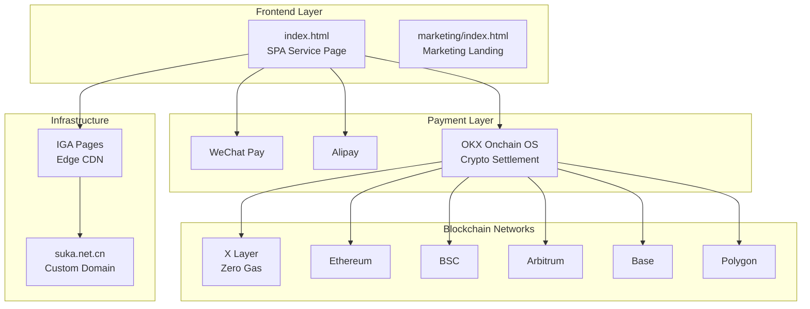

<p align="center">
  
  
  
  
</p>

<h1 align="center">SUKA.net</h1>
<h3 align="center">AI Agent Monetization Engine — Built on OKX Onchain OS</h3>

<p align="center">
  <strong>Turn AI capabilities into instant revenue.</strong><br>
  6 professional services × 6 blockchain networks × dual-currency settlement<br>
  法币 + 加密货币双通道支付 | 零 Gas 费交易 | 全链上验证
</p>

---

## 🏗 Architecture



## ✨ Features

| 类别 | 能力 |
|------|------|
| 💰 **双币种支付** | 微信支付 / 支付宝（人民币）+ USDT / ETH（加密货币） |
| ⛓️ **多链支持** | X Layer / Ethereum / BSC / Arbitrum / Base / Polygon |
| ⚡ **即时结算** | 链上智能合约自动验证，资金直达收款地址 |
| 🎯 **零 Gas** | X Layer 网络零 Gas 费交易 |
| 📱 **全端适配** | 响应式设计，桌面 + 移动端完美呈现 |
| 🔒 **安全透明** | 私钥 TEE 生成，全链上验证，无中间商 |
| 🌐 **定制域名** | suka.net.cn + IGA Pages 全球 CDN 加速 |
| 🛠 **6 项服务** | 代码开发、数据分析、网站搭建、研究报告、创意内容、1v1 咨询 |

## 📦 Service Catalog

| 服务 | 起价 | 交付物 | 技术栈 |
|------|------|--------|--------|
| Code Development & Debugging | 5 USDT | 代码 + 注释 + 说明 | React / Vue / Solidity |
| Data Analysis Report | 10 USDT | 可视化报告 + 原始数据 | Python / SQL / ECharts |
| Full-stack Web/DApp | 20 USDT | 源码 + 部署 | HTML/CSS/JS + Contracts |
| Deep Research Report | 8 USDT | PDF + 数据附件 | Multi-source |
| Creative Content | 3 USDT | 文案 / 脚本 / 设计 | Marketing / Media |
| 1-on-1 Consulting | 15 USDT / 30min | 在线会议 | Domain expertise |

## ⛓️ Supported Chains

| Network | Symbol | Gas | Status |
|---------|--------|-----|--------|
| **X Layer** | `xlayer` | **Zero** | ✅ Live |
| Ethereum | `ethereum` | High | ✅ Live |
| Arbitrum | `arbitrum` | Low | ✅ Live |
| Base | `base` | Low | ✅ Live |
| BSC | `bsc` | Low | ✅ Live |
| Polygon | `polygon` | Low | ✅ Live |

## 🚀 Quick Start

### Prerequisites

- A modern browser (Chrome / Edge / Firefox)
- OKX Wallet or any EVM-compatible wallet
- [OKX Onchain OS CLI](https://www.okx.com/web3/build/docs) (for local payment testing)

### Local Development

```bash
# Clone
git clone https://github.com/YOUR_USERNAME/onchain-payment.git
cd onchain-payment

# Copy config
cp config.example.json config.json
# Edit config.json with your wallet address

# Open in browser — no build step needed
open index.html
```

### Deployment

Deployed via [IGA Pages](https://console.volcengine.com/dcdn/pages/):

```bash
iga deploy --project ai-agent-pay
```

Live at: **[suka.net.cn](https://suka.net.cn)** (custom domain)

## 📁 Project Structure

```
onchain-payment/
├── index.html              # Main service page (SPA)
├── config.example.json     # Configuration template (safe to commit)
├── config.json             # Your local config (gitignored)
├── marketing/              # Marketing landing page & assets
│   ├── index.html          # Marketing site
│   ├── share.html          # One-click share hub
│   ├── twitter-card.html   # Social media card
│   └── 推广文案.md          # Promotion copy (中文)
├── redirect/               # DNS redirect page
│   └── index.html
├── .github/                # Issue templates & PR template
│   ├── ISSUE_TEMPLATE/
│   └── PULL_REQUEST_TEMPLATE.md
├── LICENSE                 # MIT
├── CONTRIBUTING.md         # Contribution guide
└── README.md               # You are here
```

## 🔐 Security

| 安全措施 | 说明 |
|----------|------|
| TEE 签名 | 私钥在可信执行环境中生成，不可读取 |
| 链上验证 | 支付状态全链上查询，无需信任第三方 |
| 地址直达 | 资金直接进入配置的收款地址 |
| 订单过期 | 收款单默认 30 分钟自动过期 |
| 配置隔离 | `config.json` 已 gitignore，不会泄露 |

> ⚠️ **注意**：`config.json` 包含真实钱包地址，**绝不提交到仓库**。使用 `config.example.json` 作为模板。

## 🗺 Roadmap

- [x] 6-chain EVM payment support
- [x] Fiat payment integration (WeChat / Alipay)
- [x] IGA Pages deployment with custom domain
- [x] Marketing landing page
- [ ] Solana chain support
- [ ] AI Agent autonomous service delivery
- [ ] Payment proof NFT
- [ ] Telegram Bot integration
- [ ] Recurring subscription (Stream payment)

## 🤝 Contributing

See [CONTRIBUTING.md](CONTRIBUTING.md) for detailed guidelines.

- 🐛 [Bug Report](https://github.com/YOUR_USERNAME/onchain-payment/issues/new?template=bug_report.md)
- 💡 [Feature Request](https://github.com/YOUR_USERNAME/onchain-payment/issues/new?template=feature_request.md)
- 🔧 PRs welcome — 遵循 [Conventional Commits](https://www.conventionalcommits.org/)

## 📄 License

MIT © 2026 SUKA.net — See [LICENSE](LICENSE) for details.

---

<p align="center">
  <sub>Built with ❤️ on <a href="https://www.okx.com/web3/build/os">OKX Onchain OS</a> · Powered by <a href="https://www.volcengine.com/product/dcdn">BytePlus Edge CDN</a></sub>
</p>
